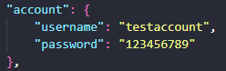

# DDoS Auto Attack

    DDoS Auto Attack es un ejecutado de ataques DDoS el cual funciona mediante selenium emulando un humano en la pagina <a href="https://www.stressthem.se">stressthem.se</a> el cual ejecuta un ataque.

    

## Instalacion

### Nota

**Se necesita python 3.10 o una version superior para ejecutar.**

### Instalar libreria virtualenv

    python3 -m pip install -r virtualenv

### Crear entorno virtual

    python3 -m virtualenv venv

### Activar entorno virtual

#### Linux

    source venv/bin/activate

#### Windows

    venv/Scripts/activate

### Instalar requirements.txt

    python3 -m pip install -r requirements.txt

## configuración y ejecución

    <ol>
        <li><b>Cambiar cuenta de <a href="https://www.stressthem.se">stressthem.se</a>, para esto debes de crear una cuenta en la pagina.</b>
            

                
            

        </li>
        <li><b>Cambiar la configuracion de ataque a la que quieras atacar.</b>
            <ul>
                <li>ip: Direccion ip a atacar</li>
                <li>method: Metodo que usara para hacer el ataque (NTP, UDP-MIX, DNS, SSDP)</li>
                <li>port: Puerto a atacar (0 - 65535)</li>
                <li>time: Tiempo que durara cada ataque (1 - 300)</li>
            </ul>
            

                
            

        </li>
        <li><b>Ejectuar Programa para empezar con el ataque.</b>
        <pre><code>python3 main.py</pre></code>
            

                
            

        </li>
    </ol>

