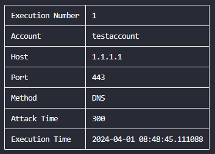

# DDoS Auto Attack

    DDoS Auto Attack is a tool for launching DDoS attacks that works by using selenium to emulate human behavior on the website <a href="https://www.stressthem.se">stressthem.se</a>, which then initiates an attack.

    

## Installation

### Note

**Python 3.10 or higher is required to run this tool.**

### Install virtualenv library

    python3 -m pip install -r virtualenv

### Create a virtual environment

    python3 -m virtualenv venv

### Activate the virtual environment

#### Linux

    source venv/bin/activate

#### Windows

    venv/Scripts/activate

### Install requirements.txt

    python3 -m pip install -r requirements.txt

## Configuration and Execution

    <ol>
        <li><b>Change your account on <a href="https://www.stressthem.se">stressthem.se</a>. To do this, you must create an account on the website.</b>
            

                
            

        </li>
        <li><b>Modify the attack settings to your desired target.</b>
            <ul>
                <li>ip: IP address to attack</li>
                <li>method: Method to use for the attack (NTP, UDP-MIX, DNS, SSDP)</li>
                <li>port: Port to attack (0 - 65535)</li>
                <li>time: Duration of each attack (1 - 300)</li>
            </ul>
            

                
            

        </li>
        <li><b>Run the program to initiate the attack.</b>
        <pre><code>python3 main.py</pre></code>
            

                
            

        </li>
    </ol>

